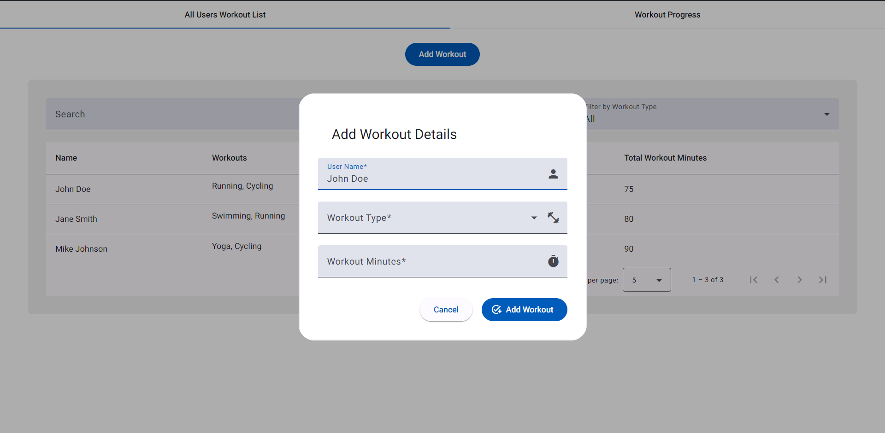
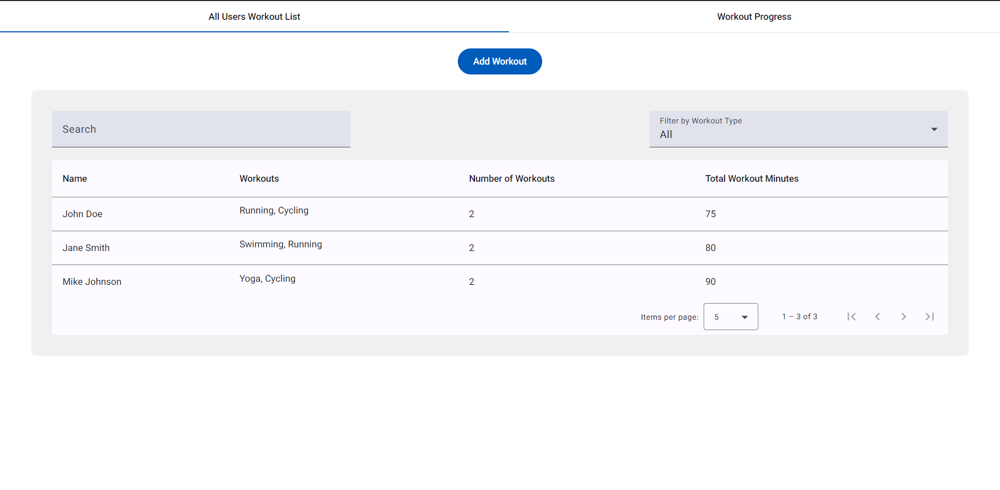
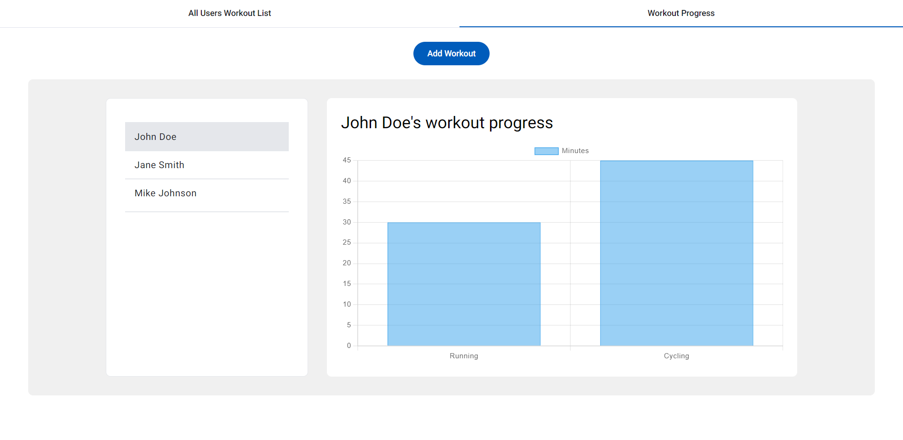

# HealthHustle

Assignment for Frontend Development Challenge July, 2024.

This project was generated with [Angular CLI](https://github.com/angular/angular-cli) version 18.1.0.


## Website





## Run in Local

- Clone the repo.
- Install dependencies using `npm install`.
- Run `ng serve` for a dev server. Navigate to `http://localhost:4200/`. The application will automatically reload if you change any of the source files.

## Code scaffolding

Run `ng generate component component-name` to generate a new component. You can also use `ng generate directive|pipe|service|class|guard|interface|enum|module`.

## Build

Run `ng build` to build the project. The build artifacts will be stored in the `dist/` directory.

## Objective

Design an Angular 14+ single-page application (SPA) to track workouts.

## Features

### Inputs

- User name
- Workout type
- Workout minutes

### User Workout List

- Display user workout entries in a table
- Search by user name and Filter by workout type
- Pagination for more than 5 users

### Optional

- Display workout progress using charts

## Implemented

- **Input Fields:**
  - On Click on `Add Workout` Button a dialog opens to add workouts.
  - Fields for adding user name, workout type, and workout minutes.
  - Add button to submit the data.
- **User Data**:
  - Initial data with 3 users in localStorage.
  - Data format:
    ```js
    userData = [
      {
        id: 1,
        name: 'John Doe',
        totalMinutes: 75,
        totalWorkouts: 2,
        workouts: [
          { type: 'Running', minutes: 30 },
          { type: 'Cycling', minutes: 45 }
        ]
      },
      ...
    ]
    ```
- **Table Grid**:
  - Display users and their workouts.
  - Search by name and Filter by workout type.
  - Pagination for more than 5 users.
- **Unit Tests**:
  - 100% code coverage for 1 component (`add-user.component.ts`) and 1 service (`add-user.service.ts`).
  - Includes code coverage report in README.
- **Library Used**:

  - Used Material UI for various components.
  - Used chartjs for Chart.

- **Styling**:
  - Use Tailwind CSS.
 
- **Deployment**:

  - Hosted on Vercel.

- **Optional Feature**:

  - Added charts to display workout progress.
  - Added Tabs for easy switching between the Workout list and Progress Chart.
  - Added Snackbar for better user feedback.

- **Assumptions Made**:
  - After adding the workout change the tab and them click on the user for which we want to see the progress chart.
